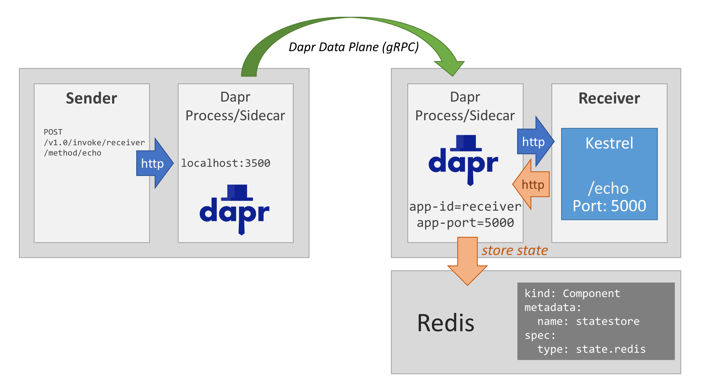

# Dapr Learning and Mini Starter Sample - Dotnet

This is a very minimal pair of .NET Core 5 apps use to get started with Dapr and to begin learning, useful for day 1 of hacks or simple demos etc.

- **Sender** - A console app makes HTTP requests to invoke Dapr app with id of `receiver` via the Dapr invocation API, every 5 seconds
- **Receiver** - An ASP.NET Core app, with a single controller route `/echo` which accepts POST requests (on port 5000), and also connects to state via the Dapr state API & building block

Note. None of the Dapr SDKs have been used, and direct calls to Dapr used in order to expose a better understanding of what is happening.

## Overview



## 🤓 Pre-Reqs

- [Dapr CLI installed](https://docs.dapr.io/getting-started/install-dapr-cli/) and [initialized on your system](https://docs.dapr.io/getting-started/install-dapr-selfhost/)
- Docker
- Make (optional but useful)
- [.NET 5 SDK](https://dotnet.microsoft.com/download/dotnet/5.0)
- Helm and Kubectl (for deployment to Kubernetes only)

## 🏃‍♂️ Running

A makefile is setup to assist with running & working with this sample

```text
$ make
help                 💬 This help message
lint                 🔎 Lint & format, will not fix but sets exit code on error
lint-fix             📜 Lint & format, will try to fix errors and modify code
images               🔨 Build container images
push                 📤 Push container images to registry
run-sender           🥎 Run sender locally using Dapr & Dotnet CLI
run-receiver         🧤 Run receiver locally using Dapr & Dotnet CLI
restore              💫 Dotnet restore
deploy               🚀 Deploy to Kubernetes
undeploy             💥 Remove from Kubernetes
clean                🧹 Clean up project
```

To run the receiver simply call `make run-receiver`, then in a separate shell or terminal run `make run-sender`, you should see messages get sent and accepted between the two.

If you do not have make, you can run

```bash
dapr run --app-id receiver --app-port 5000 -- dotnet run -p ./receiver
```

```bash
dapr run --app-id sender -- dotnet run -p ./sender
```

## ☸ Deploy to Kubernetes

See [Kubernetes readme](./kubernetes/readme.md) for details or if you're lazy and slightly brave run `make deploy`

## ♻ Echo API

The echo API exposed by the receiver is _extremely_ simple

```http
POST http://localhost:5000/echo
Content-Type: application/json

{
  "message": "Test echo"
}

--- RESP ---

HTTP/1.1 200 OK
Content-Type: application/json; charset=utf-8

{
  "message": "The echo chamber says 'Test echo'"
}
```

## 🗳 Dapr State

The receiver uses the default Dapr state store called `statestore` when running locally this is already configured by the Dapr CLI (when running `dapr init`).

The messages received by the echo API are stored in state, and the client IP address used as a key, this is purely for demonstration purposes, better choices of keys are available.

When running locally you can verify the data is being put into state with the following Redis commands below.

> Note 1. This assumes you don't have the `redis-cli` installed and instead runs it via Docker.
>
> Note 2. This connects to the Redis container running on your system which was started by the Dapr `dapr init` command, this container is named `dapr_redis` and can be seen when running `docker ps`

List all keys

```bash
docker run --rm -it --link dapr_redis redis redis-cli -h dapr_redis KEYS "*"
```

Get data for a given key

```bash
docker run --rm -it --link dapr_redis redis redis-cli -h dapr_redis HGETALL "receiver||127.0.0.1"
```
